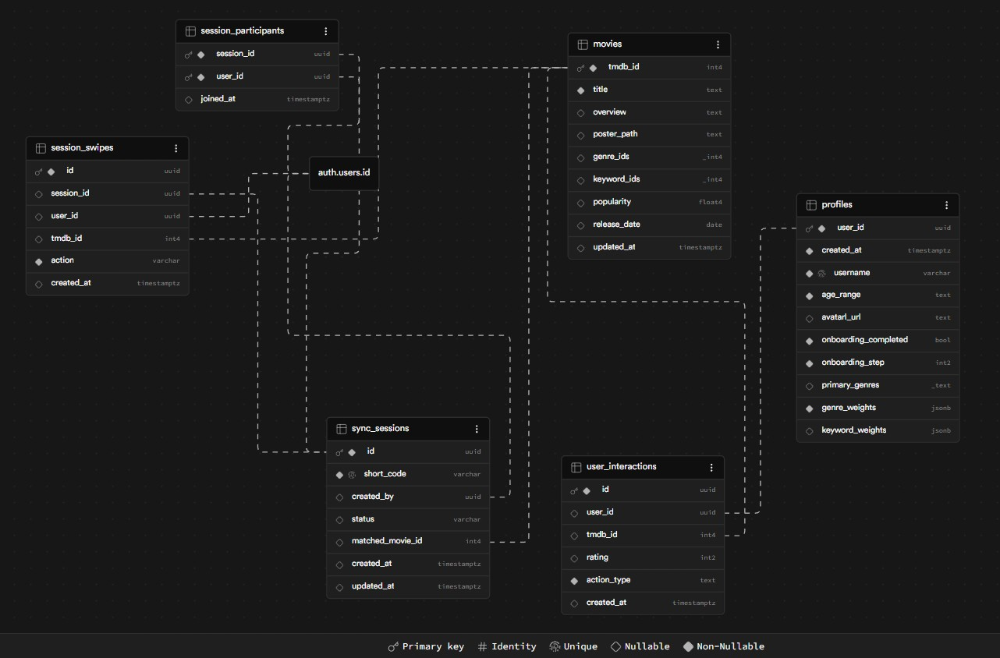

# Movie Matching Webapp

> **Attribution Notice:** This product uses the [TMDB API](https://www.themoviedb.org/) but is not endorsed or certified by TMDB.

Movie Matching is a React + TypeScript app for browsing movies, rating titles, and managing user access with Supabase authentication.

[A React + TypeScript web application that collects user movie ratings to generate personalized, algorithm-driven recommendations for films they haven't seen, while also supporting pair-based matching that computes joint preference profiles to suggest movies optimized for two users watching together.]

## Tech Stack

- [React 19](https://react.dev/)
- [TypeScript 5.9](https://www.typescriptlang.org/)
- [Vite 7](https://vitejs.dev/)
- [Tailwind CSS 4](https://tailwindcss.com/)
- [React Router DOM](https://reactrouter.com/)
- [React Query (@tanstack/react-query)](https://tanstack.com/query/latest)
- [Framer Motion (motion/react)](https://motion.dev/)
- [shadcn/ui](https://ui.shadcn.com/) + [Base UI](https://base-ui.com/)
- [Supabase (Auth)](https://supabase.com/)
- [pnpm](https://pnpm.io/)

### Frontend
- **[React 19](https://react.dev/)** - UI library with hooks-based architecture
- **[TypeScript 5.9](https://www.typescriptlang.org/)** - Type-safe JavaScript
- **[Vite 7](https://vitejs.dev/)** - Fast build tool and dev server
- **[Tailwind CSS 4](https://tailwindcss.com/)** - Utility-first CSS framework
- **[Framer Motion](https://motion.dev/)** - Handling complex swipe and drag animations on cards

### UI Components
- **[shadcn/ui](https://ui.shadcn.com/)** - Accessible, customizable component library built on:
  - [Base UI](https://base-ui.com/)
  - Class Variance Authority (CVA) for variant styling
- Components implemented: Alert, Button, ButtonGroup, Card, DropdownMenu, Input, Label, Progress, Separator, Skeleton

### Data & State
- **[React Query](https://tanstack.com/query/latest)** - Used for infinitely fetching and caching TMDB movie data and searches.
- **[Zod](https://zod.dev/) & [React Hook Form](https://react-hook-form.com/)** - Powering validation and complex onboarding steps.

### Backend (Supabase)
- **[Supabase Auth](https://supabase.com/docs/guides/auth)** - Handling user registration and session cookies/JWT logic.
- **Supabase Database (PostgreSQL)** - Currently interacting with:
  - `profiles` table: 
    - Holds application-specific user metadata tied to the Auth UID (`user_id`, `username`, `age_range`, `onboarding_completed`, `onboarding_step`, `primary_genres`, `genre_weights`).
  - *Future architecture plans include migrating purely client-side local rating states into standard relational DB `ratings`/`history` tables within Supabase.*

### Package Management
- **pnpm** - Fast, disk space efficient package manager with workspace support


## Current Implementations

### Routing Architecture & Pages

The application utilizes `react-router-dom` with a `Suspense` wrapper for lazy-loading page chunks. Routing logic integrates tightly with `AuthContext` to enforce session restrictions and onboarding completion guard rails.

- **`/` (Root)** - Evaluates auth state. Renders `LandingPage` for unauthenticated traffic, redirects to `/signup` if user onboarding is incomplete. When fully authenticated, renders the `Layout` wrapper resolving `HomePage`. 
  - **`HomePage` (`/`)**: Displays the `SwipeDeck`—a Framer Motion-powered interactive discovery tool fetching TMDB data infinitely so users can drag, skip, or save movies to a Watch Later queue.
- **`/login`** - Authenticates returning users via Supabase Auth. Seamlessly redirects to the signup flow if the user login succeeds but the `profiles.onboarding_completed` flag evaluates as falsy.
- **`/signup`** - Provides the user registration entry alongside a multi-step onboarding wizard. Built with `Zod` and `react-hook-form` to initialize `profiles` table records (capturing age range, username, and baseline algorithmic genre weights).
- **`/search`** (`MoviesPage`) - An infinite scrolling movie index leveraging React Query (`useInfiniteQuery`) and an Intersection Observer. Features debounced input processing to prevent TMDB API rate-limiting.
- **`/sync`** (`SyncPage`) - A collaborative group-matching engine. Uses Supabase Realtime Channels (`pg_changes` and broadcast events) to synchronize participants in a lobby, compute a unified movie deck utilizing aggregated profile preferences, and deterministically track when all room users 'save' the same movie context in real-time.
- **`/profile`** (`ProfilePage`) - Visualizes synced Supabase profile metadata along with aggregating local application states to render user rating history and Watch Later queues arrays.

### Theme System

- Light, dark, and system theme support.
- Theme selection persisted in localStorage (`movie-matching-theme`).
- Theme toggle available on auth pages and authenticated layout.

### Movie Catalog & Swipe Deck

- Real-time fetching of popular or searched movies via The Movie Database (TMDB) API.
- Implements a Tinder-like `SwipeDeck` leveraging Framer Motion for draggable cards.
- Users can:
  - Swipe Right: Add to Watch Later.
  - Swipe Up: Skip movie.
  - Rate: Use a 5-star widget directly mapped inside the swipe card.
- Displays key metadata per movie natively via TMDB integration:
  - title
  - release year
  - average score
  - overview / synopsis
  - dynamic poster images

### Movie Search & Grids

- Dedicated Search `/search` implementation.
- Infinite scroll grids implemented utilizing React Query and Intersection Observer.
- Search features a debounce architecture to prevent API limits while typing.

### Profile Page

- Dedicated `/profile` route.
- Profile card and liked-movies history UI.
- Currently uses placeholder profile data structure for demo purposes.

## Data Flow & Architecture

The application blends client-side API fetching with real-time cloud database synchronization to deliver a fast, collaborative experience.

1. **Data Retrieval (TMDB & React Query)**: The client directly queries the TMDB API for movie lists, recommendations, and search results. Responses are paginated and aggressively cached in the browser using React Query, ensuring smooth dragging/swiping UI with minimal latency.
2. **Local State**: Solo user interactions (like 5-star ratings or "Watch Later" queues) are initially managed via custom hooks (`useMovieHistory`) and safely persisted to `localStorage`.
3. **Collaborative Matching (Supabase Realtime)**: When users enter the "Host a Night" flow (`/sync`), the app relies on Supabase for distributed state:
   - **Profiles & Identity**: `Supabase Auth` manages JWT sessions, tracking user IDs against a secure `profiles` relational table containing genre preferences.
   - **Realtime Sessions**: The `sync_sessions` and `session_participants` tables track the lobby logic. Supabase Realtime Channels broadcast status updates instantly.
   - **Swipe Tallying**: As users swipe, the client upserts minimum required metadata to a local `movies` table (to satisfy foreign keys) and records the action in `session_swipes`. A real-time listener alerts the client when all participants have collectively "saved" the same movie.



### Data Dictionary

*Note: References to TMDB refer to The Movie Database external IDs.*

**`profiles` (Primary user metadata)**
- `user_id` *(uuid, primary key, maps to auth.users)*
- `username` *(text)*
- `age_range` *(text)*
- `avatar_url` *(text - object path to the Supabase storage `pictures` bucket)*
- `onboarding_step` *(integer)*
- `onboarding_completed` *(boolean)*
- `primary_genres` *(text array - string descriptors of preferred genres)*
- `genre_weights` *(jsonb - mapping of TMDB genre IDs to weighted interaction scores)*

**`movies` (Cached TMDB metadata to satisfy foreign keys)**
- `tmdb_id` *(integer, primary key)*
- `title` *(text)*
- `poster_path` *(text)*
- `overview` *(text)*
- `genre_ids` *(integer array)*
- `release_date` *(date)*

**`user_interactions` (Historical ratings & actions)**
- `user_id` *(uuid, foreign key to profiles)*
- `tmdb_id` *(integer, foreign key to movies)*
- `rating` *(integer null - 1 through 5 star rating if action_type is rate)*
- `action_type` *(text - e.g., 'rate', 'watch_later')*

**`sync_sessions` (Lobbies for pair matching)**
- `id` *(uuid, primary key)*
- `short_code` *(text - 6-character room code)*
- `created_by` *(uuid, foreign key to profiles)*
- `status` *(text - 'waiting' | 'swiping' | 'matched')*
- `matched_movie_id` *(integer null, foreign key to movies - populated upon match)*

**`session_participants` (Users inside a lobby)**
- `session_id` *(uuid, foreign key to sync_sessions)*
- `user_id` *(uuid, foreign key to profiles)*
- `joined_at` *(timestampz)*

**`session_swipes` (Individual match decisions inside a lobby)**
- `session_id` *(uuid, foreign key to sync_sessions)*
- `user_id` *(uuid, foreign key to profiles)*
- `tmdb_id` *(integer, foreign key to movies)*
- `action` *(text - 'save' | 'discard')*

## Project Structure

```text
src/
  components/
    layout.tsx
    mode-toggle.tsx
    MovieCard.tsx
    SwipeDeck.tsx
    theme-provider.tsx
    skeletons/
    ui/
      (various shadcn/ui components)
  contexts/
    AuthContext.tsx
  features/
    onboarding/
      components/
        Step1AccountForm.tsx
        Step2ProfileForm.tsx
        Step3RateMovies.tsx
  hooks/
    useDebounce.ts
    useMovieHistory.ts
    useMovies.ts
  lib/
    supabase.ts
    tmdb.ts
    utils.ts
  pages/
    HomePage.tsx
    Login.tsx
    MoviesPage.tsx
    ProfilePage.tsx
    SignUp.tsx
    SyncPage.tsx
  App.tsx
  index.css
  main.tsx
```

## Environment Variables

Create a `.env` file in the project root with:

```bash
VITE_SUPABASE_URL=your_supabase_project_url
VITE_SUPABASE_PUBLISHABLE_DEFAULT_KEY=your_supabase_anon_or_publishable_key
```

The app throws an error on startup if these values are missing.

## Getting Started

```bash
pnpm install
pnpm dev
```

## Available Scripts

```bash
pnpm dev      # Run Vite dev server
pnpm build    # Type-check and build for production
pnpm preview  # Preview production build locally
pnpm lint     # Run ESLint
```

## Notes

- Ratings history and Watch Later data are currently tracked client-side (`localStorage`) and through React Query cache.
- True database syncing for movies and recommendation/pair-matching backend logic are ongoing implementations in progress.

---

> **Attribution Notice:** This product uses the [TMDB API](https://www.themoviedb.org/) but is not endorsed or certified by TMDB.